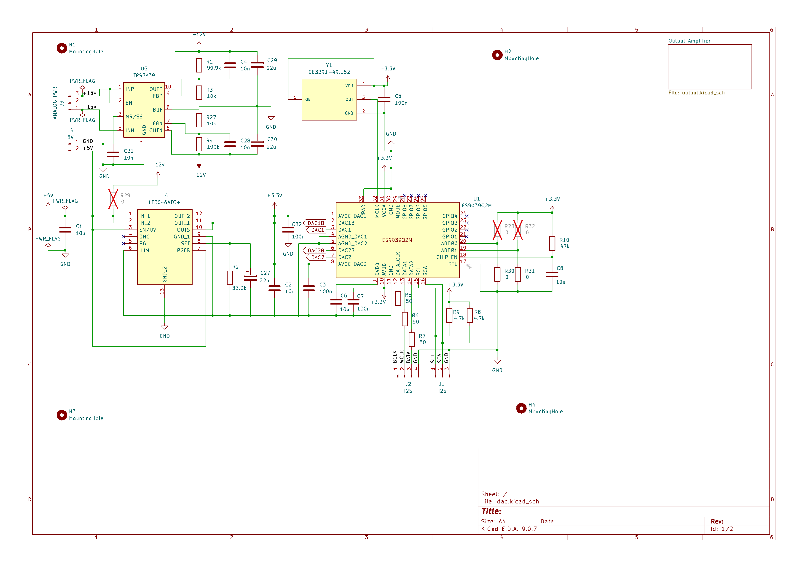
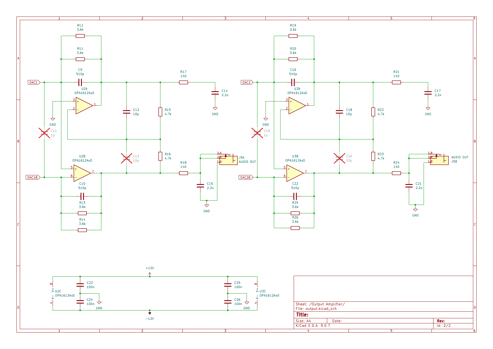

# BogDAC - A no frills DAC board for ES9039Q2M

## Introduction
I like to keep things simple. Reading about people "improving" their DACs with femtosecond-precision clocks, re-clockers, hundreds of farads of capacitance and potting soil (yes, potting soil), I decided I wanted to create a bog standard
DAC board based on the ES9039Q2M chip. I wanted a small board that would just accept an I2S stream and I2C commands and output single-ended audio. 

## Design Overview
This is following my Bog Standard concept: Keep things simple, follow best practices and avoid audiophile fads. The chip is locked into software mode and asynchronous I2S (a.k.a. PCM) operations using a local 49.152MHz oscillator. This 
allows for a design with a very simple and short clock signal path and should (at least in my opinion) perform better than external clocks connected through wires. The output section is pretty much just the one suggested in the data sheet and
based on OPA1612. The +/- 12V power for the analog section is provided by a TPS7A39 regulator. The 3.3V power for the analog reference voltages and the digital power is fed by a LT3046 regulator. The L3046 can be fed either from a separate 5V
power input or from the 12V rail by installing a jumper. Please note that nothing should be plugged into the 5V inlet if the jumper is installed.

## Schematic

## More to come...
I will provide more information as time permits. For now, feel free to check out the KiCAD schematic and PCB!
